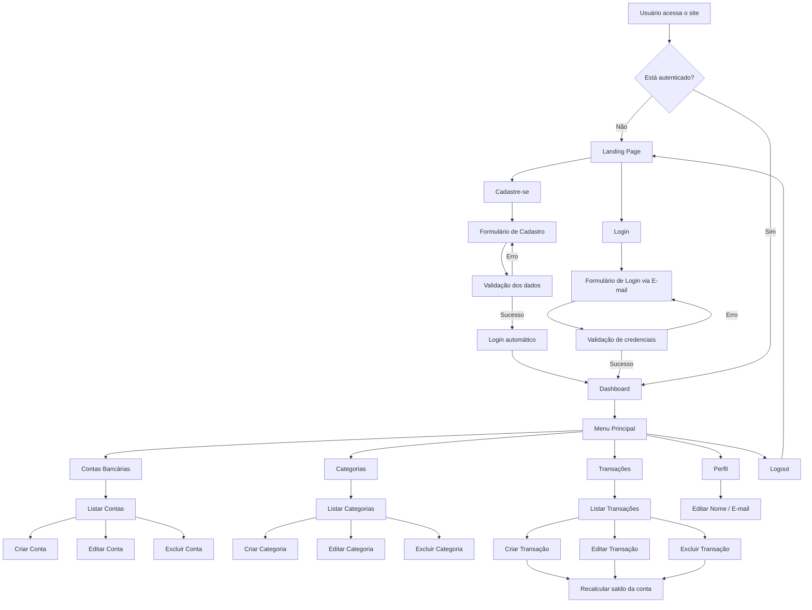
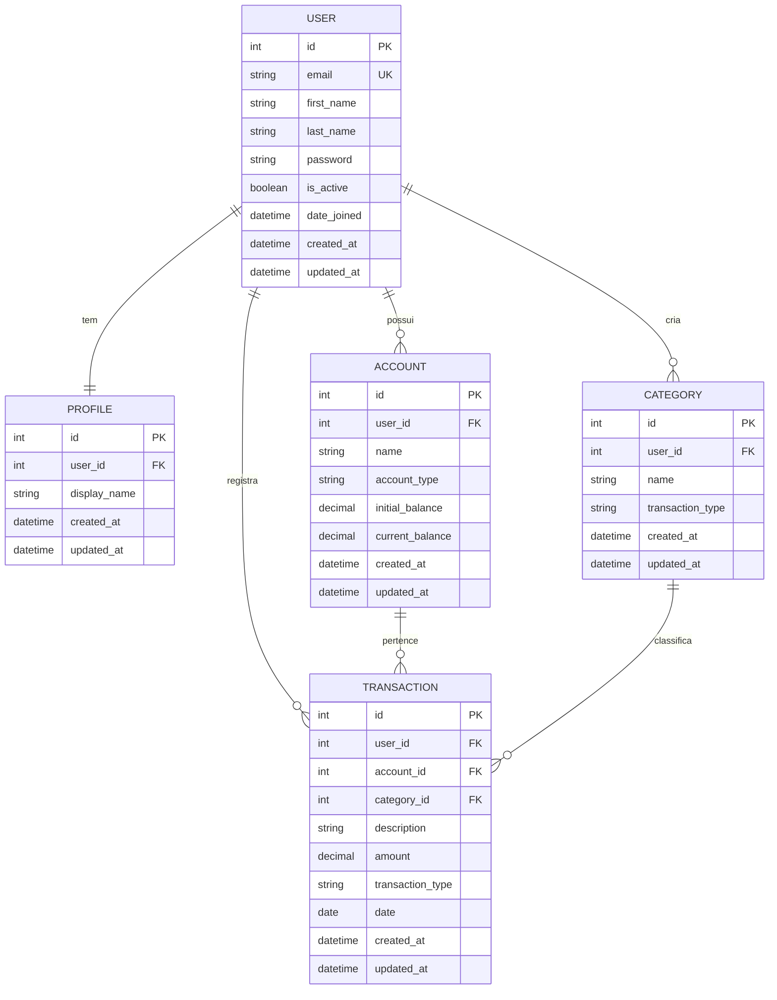

# PRD — Finanpy: Sistema de Gestão de Finanças Pessoais

> **Versão:** 1.0  
> **Data:** 05/04/2026  
> **Autor:** Igor  
> **Status:** Draft

---

## Sumário

1. [Visão Geral](#1-visão-geral)
2. [Sobre o Produto](#2-sobre-o-produto)
3. [Propósito](#3-propósito)
4. [Público-Alvo](#4-público-alvo)
5. [Objetivos](#5-objetivos)
6. [Requisitos Funcionais](#6-requisitos-funcionais)
7. [Requisitos Não-Funcionais](#7-requisitos-não-funcionais)
8. [Arquitetura Técnica](#8-arquitetura-técnica)
9. [Design System](#9-design-system)
10. [User Stories](#10-user-stories)
11. [Métricas de Sucesso](#11-métricas-de-sucesso)
12. [Riscos e Mitigações](#12-riscos-e-mitigações)
13. [Lista de Tarefas (Sprints)](#13-lista-de-tarefas-sprints)

---

## 1. Visão Geral

O **Finanpy** é um sistema web de gestão de finanças pessoais desenvolvido com Django full-stack. Permite que usuários registrem contas bancárias, categorizem transações (entradas e saídas) e acompanhem sua saúde financeira por meio de um dashboard centralizado. O projeto prioriza simplicidade, sem over-engineering, utilizando os recursos nativos do Django sempre que possível.

---

## 2. Sobre o Produto

| Atributo | Descrição |
|---|---|
| **Nome** | Finanpy |
| **Tipo** | Aplicação web full-stack |
| **Framework** | Django (Python) |
| **Frontend** | Django Template Language + TailwindCSS |
| **Banco de dados** | SQLite (padrão Django) |
| **Autenticação** | Sistema nativo do Django (login via e-mail) |
| **Idioma da interface** | Português brasileiro |
| **Idioma do código** | Inglês |

---

## 3. Propósito

Oferecer uma ferramenta simples, funcional e visualmente agradável para que pessoas possam organizar suas finanças pessoais — registrando contas, categorias e transações — sem a complexidade de ferramentas corporativas. O Finanpy visa ser o ponto de partida para o controle financeiro de quem nunca usou ou abandonou planilhas.

---

## 4. Público-Alvo

- **Jovens adultos (18-35 anos)** que estão começando a organizar suas finanças.
- **Estudantes e profissionais** que desejam controle básico de entradas e saídas.
- **Usuários não-técnicos** que precisam de uma interface intuitiva, sem jargão financeiro excessivo.
- **Pessoas que abandonaram planilhas** por achar complexo ou pouco visual.

---

## 5. Objetivos

| # | Objetivo | Métrica de validação |
|---|---|---|
| O1 | Permitir cadastro e login de usuários via e-mail | Fluxo completo funcional |
| O2 | Gerenciar contas bancárias (CRUD) | Usuário consegue criar, editar, listar e excluir contas |
| O3 | Gerenciar categorias de transações (CRUD) | Categorias criadas e atribuídas a transações |
| O4 | Registrar transações de entrada e saída (CRUD) | Transações vinculadas a conta + categoria |
| O5 | Exibir dashboard com resumo financeiro | Dashboard com saldo, totais de entrada/saída |
| O6 | Oferecer landing page pública | Página de apresentação com acesso a cadastro/login |

---

## 6. Requisitos Funcionais

### RF01 — Landing Page (pública)
- Página de apresentação do sistema.
- Botões de "Cadastre-se" e "Entrar".
- Sem acesso a funcionalidades internas.

### RF02 — Cadastro de Usuário
- Formulário com: nome, e-mail, senha, confirmação de senha.
- Validação de e-mail único.
- Login automático após cadastro (redireciona ao dashboard).

### RF03 — Login / Logout
- Login via **e-mail + senha** (não username).
- Redirecionamento ao dashboard após login.
- Logout com redirecionamento à landing page.

### RF04 — Perfil do Usuário
- Edição de nome e e-mail.
- Dados exibidos no menu do sistema (nome do usuário).

### RF05 — Gerenciamento de Contas Bancárias
- CRUD completo (criar, listar, editar, excluir).
- Campos: nome da conta, tipo (corrente, poupança, carteira, investimento), saldo inicial.
- Saldo atualizado automaticamente conforme transações.
- Cada conta pertence exclusivamente ao usuário logado.

### RF06 — Gerenciamento de Categorias
- CRUD completo.
- Campos: nome, tipo (entrada ou saída), ícone/cor (opcional).
- Categorias vinculadas ao usuário.
- Categorias padrão criadas automaticamente no cadastro (ex: Salário, Alimentação, Transporte).

### RF07 — Gerenciamento de Transações
- CRUD completo.
- Campos: descrição, valor, data, tipo (entrada/saída), conta, categoria.
- Listagem com filtros por período, tipo, conta e categoria.
- Ao criar/editar/excluir transação, o saldo da conta é recalculado.

### RF08 — Dashboard
- Saldo total (soma dos saldos de todas as contas).
- Total de entradas e saídas do mês corrente.
- Lista das últimas transações.
- Resumo por categoria (quanto foi gasto/recebido por categoria no mês).

### Flowchart — Fluxos de UX



---

## 7. Requisitos Não-Funcionais

| # | Requisito | Detalhe |
|---|---|---|
| RNF01 | **Responsividade** | Interface funcional em desktop, tablet e mobile |
| RNF02 | **Performance** | Páginas carregam em < 2s com SQLite local |
| RNF03 | **Segurança** | CSRF protection (nativo Django), senhas com hash, acesso restrito por login |
| RNF04 | **Padrão de código** | PEP08, aspas simples, código em inglês |
| RNF05 | **Isolamento de domínios** | Cada entidade em sua própria Django app |
| RNF06 | **Auditoria básica** | Campos `created_at` e `updated_at` em todos os models |
| RNF07 | **Simplicidade** | Sem over-engineering; usar recursos nativos do Django |
| RNF08 | **Banco de dados** | SQLite padrão do Django |
| RNF09 | **Interface em PT-BR** | Toda informação ao usuário em português brasileiro |
| RNF10 | **Class Based Views** | Usar CBVs sempre que possível |

---

## 8. Arquitetura Técnica

### 8.1 Stack

| Camada | Tecnologia |
|---|---|
| Linguagem | Python 3.13+ |
| Framework backend | Django 5+ |
| Frontend | Django Template Language |
| Estilização | TailwindCSS (via CDN ou standalone CLI) |
| Banco de dados | SQLite3 |
| Servidor de dev | `manage.py runserver` |
| Autenticação | `django.contrib.auth` (customizado para login via e-mail) |
| Gerenciamento de pacotes | pip + requirements.txt |

### 8.2 Estrutura de Diretórios

```
finanpy/
├── accounts/          # Contas bancárias do usuário
├── categories/        # Categorias de transações
├── core/              # Configurações globais (settings, urls, wsgi, asgi)
├── profiles/          # Perfil do usuário
├── transactions/      # Transações financeiras
├── users/             # Model de usuário customizado + autenticação
├── templates/         # Templates globais (base, landing, components)
│   ├── base.html
│   ├── components/
│   │   ├── navbar.html
│   │   ├── sidebar.html
│   │   ├── card.html
│   │   ├── modal_confirm.html
│   │   └── messages.html
│   ├── landing.html
│   └── dashboard.html
├── static/            # Arquivos estáticos globais
│   ├── css/
│   └── js/
├── db.sqlite3
├── manage.py
└── requirements.txt
```

### 8.3 Estrutura de Dados (ER Diagram)



### 8.4 Detalhamento dos Models

**User** (herda de `AbstractUser`)
- `email`: EmailField, unique, usado como USERNAME_FIELD
- `username`: removido ou ignorado no fluxo
- `created_at`: DateTimeField, auto_now_add
- `updated_at`: DateTimeField, auto_now

**Profile** (OneToOne com User)
- `user`: OneToOneField → User
- `display_name`: CharField, max 100
- `created_at` / `updated_at`

**Account**
- `user`: ForeignKey → User
- `name`: CharField, max 100
- `account_type`: CharField, choices (checking, savings, wallet, investment)
- `initial_balance`: DecimalField(10, 2), default 0
- `current_balance`: DecimalField(10, 2), default 0
- `created_at` / `updated_at`

**Category**
- `user`: ForeignKey → User
- `name`: CharField, max 50
- `transaction_type`: CharField, choices (income, expense)
- `created_at` / `updated_at`

**Transaction**
- `user`: ForeignKey → User
- `account`: ForeignKey → Account
- `category`: ForeignKey → Category
- `description`: CharField, max 200
- `amount`: DecimalField(10, 2)
- `transaction_type`: CharField, choices (income, expense)
- `date`: DateField
- `created_at` / `updated_at`

---

## 9. Design System

### 9.1 Paleta de Cores (TailwindCSS classes)

| Papel | Classe TailwindCSS | Hex aproximado | Uso |
|---|---|---|---|
| **Background principal** | `bg-gray-950` | #0B0F19 | Fundo do body |
| **Background cards** | `bg-gray-900` | #111827 | Cards, sidebar, modals |
| **Background inputs** | `bg-gray-800` | #1F2937 | Campos de formulário |
| **Border padrão** | `border-gray-700` | #374151 | Bordas de cards, inputs, dividers |
| **Texto primário** | `text-gray-100` | #F3F4F6 | Títulos, texto principal |
| **Texto secundário** | `text-gray-400` | #9CA3AF | Labels, descrições, placeholders |
| **Accent primário** | `bg-emerald-500` | #10B981 | Botões primários, entradas |
| **Accent hover** | `hover:bg-emerald-600` | #059669 | Hover de botões primários |
| **Accent secundário** | `bg-violet-500` | #8B5CF6 | Destaques, badges, links ativos |
| **Perigo / Saída** | `bg-rose-500` | #F43F5E | Botão excluir, valores de saída |
| **Sucesso** | `text-emerald-400` | #34D399 | Valores de entrada, saldo positivo |
| **Alerta** | `text-amber-400` | #FBBF24 | Avisos, saldo baixo |
| **Gradient header** | `bg-gradient-to-r from-emerald-500 to-violet-500` | — | Barra superior, títulos especiais |

### 9.2 Tipografia

| Elemento | Classes TailwindCSS |
|---|---|
| **Font família** | `font-sans` (Inter via Google Fonts como fallback do sistema) |
| **Título da página (h1)** | `text-2xl font-bold text-gray-100` |
| **Subtítulo (h2)** | `text-xl font-semibold text-gray-100` |
| **Título de card (h3)** | `text-lg font-semibold text-gray-100` |
| **Corpo de texto** | `text-sm text-gray-300` |
| **Label** | `text-sm font-medium text-gray-400` |
| **Texto auxiliar** | `text-xs text-gray-500` |

### 9.3 Botões

```html
<!-- Primário -->
<button class="bg-emerald-500 hover:bg-emerald-600 text-white font-medium
    py-2 px-4 rounded-lg transition-colors duration-200">
    Salvar
</button>

<!-- Secundário -->
<button class="bg-gray-700 hover:bg-gray-600 text-gray-200 font-medium
    py-2 px-4 rounded-lg transition-colors duration-200">
    Cancelar
</button>

<!-- Perigo -->
<button class="bg-rose-500 hover:bg-rose-600 text-white font-medium
    py-2 px-4 rounded-lg transition-colors duration-200">
    Excluir
</button>

<!-- Outline -->
<button class="border border-gray-600 hover:border-emerald-500
    text-gray-300 hover:text-emerald-400 font-medium
    py-2 px-4 rounded-lg transition-colors duration-200">
    Ver detalhes
</button>
```

### 9.4 Inputs e Formulários

```html
<!-- Campo de texto -->
<div class="mb-4">
    <label class="block text-sm font-medium text-gray-400 mb-1">E-mail</label>
    <input type="email"
        class="w-full bg-gray-800 border border-gray-700 rounded-lg
        py-2 px-3 text-gray-100 placeholder-gray-500
        focus:outline-none focus:ring-2 focus:ring-emerald-500
        focus:border-emerald-500 transition-colors duration-200"
        placeholder="seu@email.com">
</div>

<!-- Select -->
<select class="w-full bg-gray-800 border border-gray-700 rounded-lg
    py-2 px-3 text-gray-100 focus:outline-none focus:ring-2
    focus:ring-emerald-500 focus:border-emerald-500
    transition-colors duration-200">
    <option value="">Selecione...</option>
</select>

<!-- Form container -->
<form class="bg-gray-900 border border-gray-700 rounded-xl p-6 space-y-4">
    <!-- campos aqui -->
</form>
```

### 9.5 Cards

```html
<!-- Card padrão -->
<div class="bg-gray-900 border border-gray-700 rounded-xl p-6">
    <h3 class="text-lg font-semibold text-gray-100 mb-2">Título</h3>
    <p class="text-sm text-gray-400">Conteúdo do card</p>
</div>

<!-- Card com destaque (gradient top border) -->
<div class="bg-gray-900 border border-gray-700 rounded-xl p-6
    border-t-2 border-t-emerald-500">
    <h3 class="text-lg font-semibold text-gray-100 mb-2">Saldo Total</h3>
    <p class="text-3xl font-bold text-emerald-400">R$ 5.230,00</p>
</div>
```

### 9.6 Layout e Grid

```html
<!-- Container principal (logado) -->
<div class="min-h-screen bg-gray-950 text-gray-100">
    <!-- Navbar fixa no topo -->
    <nav class="bg-gray-900 border-b border-gray-700 px-6 py-3">
        <!-- logo, menu, user info -->
    </nav>

    <div class="flex">
        <!-- Sidebar (desktop) -->
        <aside class="hidden md:block w-64 bg-gray-900 border-r
            border-gray-700 min-h-screen p-4">
            <!-- links de navegação -->
        </aside>

        <!-- Conteúdo principal -->
        <main class="flex-1 p-6">
            <!-- conteúdo da página -->
        </main>
    </div>
</div>

<!-- Grid responsivo para cards do dashboard -->
<div class="grid grid-cols-1 md:grid-cols-2 lg:grid-cols-3 gap-6">
    <!-- cards -->
</div>

<!-- Grid de tabela responsiva -->
<div class="overflow-x-auto">
    <table class="w-full text-sm text-left">
        <thead class="text-xs text-gray-400 uppercase bg-gray-800">
            <tr>
                <th class="px-4 py-3">Coluna</th>
            </tr>
        </thead>
        <tbody class="divide-y divide-gray-700">
            <tr class="bg-gray-900 hover:bg-gray-800 transition-colors">
                <td class="px-4 py-3 text-gray-300">Valor</td>
            </tr>
        </tbody>
    </table>
</div>
```

### 9.7 Navbar e Sidebar

```html
<!-- Navbar -->
<nav class="bg-gray-900/80 backdrop-blur-sm border-b border-gray-700
    px-6 py-3 flex items-center justify-between sticky top-0 z-50">
    <!-- Logo com gradient -->
    <a href="/" class="text-xl font-bold bg-gradient-to-r
        from-emerald-400 to-violet-400 bg-clip-text text-transparent">
        Finanpy
    </a>
    <!-- User menu -->
    <div class="flex items-center gap-4">
        <span class="text-sm text-gray-400">Olá, {{ user.first_name }}</span>
        <a href="" class="text-sm text-gray-400 hover:text-rose-400
            transition-colors">Sair</a>
    </div>
</nav>

<!-- Sidebar item -->
<a href="#" class="flex items-center gap-3 px-3 py-2 rounded-lg
    text-gray-400 hover:text-gray-100 hover:bg-gray-800
    transition-colors duration-200">
    <!-- ícone SVG -->
    <span class="text-sm font-medium">Dashboard</span>
</a>

<!-- Sidebar item ativo -->
<a href="#" class="flex items-center gap-3 px-3 py-2 rounded-lg
    text-emerald-400 bg-emerald-500/10">
    <!-- ícone SVG -->
    <span class="text-sm font-medium">Dashboard</span>
</a>
```

### 9.8 Mensagens de Feedback (Django Messages)

```html
<!-- Sucesso -->
<div class="bg-emerald-500/10 border border-emerald-500/30 text-emerald-400
    rounded-lg px-4 py-3 text-sm">
    Operação realizada com sucesso!
</div>

<!-- Erro -->
<div class="bg-rose-500/10 border border-rose-500/30 text-rose-400
    rounded-lg px-4 py-3 text-sm">
    Erro ao processar sua solicitação.
</div>

<!-- Alerta -->
<div class="bg-amber-500/10 border border-amber-500/30 text-amber-400
    rounded-lg px-4 py-3 text-sm">
    Atenção: verifique os campos destacados.
</div>
```

### 9.9 Modal de Confirmação

```html
<!-- Overlay + Modal -->
<div class="fixed inset-0 bg-black/60 backdrop-blur-sm flex items-center
    justify-center z-50">
    <div class="bg-gray-900 border border-gray-700 rounded-xl p-6
        w-full max-w-md mx-4">
        <h3 class="text-lg font-semibold text-gray-100 mb-2">
            Confirmar exclusão
        </h3>
        <p class="text-sm text-gray-400 mb-6">
            Tem certeza que deseja excluir este item? Esta ação não pode ser desfeita.
        </p>
        <div class="flex justify-end gap-3">
            <button class="bg-gray-700 hover:bg-gray-600 text-gray-200
                font-medium py-2 px-4 rounded-lg">Cancelar</button>
            <button class="bg-rose-500 hover:bg-rose-600 text-white
                font-medium py-2 px-4 rounded-lg">Excluir</button>
        </div>
    </div>
</div>
```

---

## 10. User Stories

### Épico 1 — Autenticação e Perfil

**US01 — Cadastro de usuário**
> Como visitante, quero me cadastrar com nome, e-mail e senha para ter acesso ao sistema.

Critérios de aceite:
- Formulário exige nome, e-mail, senha e confirmação de senha.
- E-mail deve ser único; exibir erro se já cadastrado.
- Senha com mínimo de 8 caracteres (validação nativa Django).
- Após cadastro, o usuário é logado automaticamente e redirecionado ao dashboard.

**US02 — Login via e-mail**
> Como usuário cadastrado, quero fazer login com meu e-mail e senha para acessar o sistema.

Critérios de aceite:
- Campo de login é **e-mail** (não username).
- Mensagem de erro genérica em caso de credenciais inválidas.
- Após login, redireciona ao dashboard.

**US03 — Logout**
> Como usuário logado, quero fazer logout para encerrar minha sessão.

Critérios de aceite:
- Botão de logout visível no menu/navbar.
- Após logout, redireciona à landing page.

**US04 — Edição de perfil**
> Como usuário logado, quero editar meu nome e e-mail.

Critérios de aceite:
- Formulário pré-preenchido com dados atuais.
- Validação de e-mail único ao alterar.
- Mensagem de sucesso após salvar.

### Épico 2 — Contas Bancárias

**US05 — Criar conta bancária**
> Como usuário logado, quero criar uma conta bancária para registrar meu saldo.

Critérios de aceite:
- Campos: nome, tipo (Corrente, Poupança, Carteira, Investimento), saldo inicial.
- Saldo atual é definido como saldo inicial na criação.
- Conta vinculada ao usuário logado.

**US06 — Listar contas bancárias**
> Como usuário logado, quero ver todas as minhas contas bancárias e seus saldos.

Critérios de aceite:
- Lista apenas contas do usuário logado.
- Exibe nome, tipo e saldo atual de cada conta.
- Botões de editar e excluir por conta.

**US07 — Editar conta bancária**
> Como usuário logado, quero editar nome e tipo da minha conta.

Critérios de aceite:
- Formulário pré-preenchido.
- Não permite editar saldo inicial (é histórico).
- Mensagem de sucesso.

**US08 — Excluir conta bancária**
> Como usuário logado, quero excluir uma conta que não uso mais.

Critérios de aceite:
- Modal de confirmação antes de excluir.
- Exclui todas as transações vinculadas (CASCADE) ou impede exclusão se houver transações (definir na sprint).
- Mensagem de sucesso.

### Épico 3 — Categorias

**US09 — Criar categoria**
> Como usuário logado, quero criar categorias para organizar minhas transações.

Critérios de aceite:
- Campos: nome e tipo (Entrada ou Saída).
- Categoria vinculada ao usuário logado.

**US10 — Listar categorias**
> Como usuário logado, quero ver todas as minhas categorias.

Critérios de aceite:
- Lista separada ou filtrada por tipo (entrada/saída).
- Botões de editar e excluir.

**US11 — Editar categoria**
> Como usuário logado, quero editar o nome e tipo de uma categoria.

Critérios de aceite:
- Formulário pré-preenchido.
- Mensagem de sucesso.

**US12 — Excluir categoria**
> Como usuário logado, quero excluir uma categoria que não uso mais.

Critérios de aceite:
- Modal de confirmação.
- Impede exclusão se houver transações vinculadas (exibe mensagem).

**US13 — Categorias padrão no cadastro**
> Como novo usuário, quero ter categorias pré-cadastradas para começar a usar rápido.

Critérios de aceite:
- Ao criar conta, gerar automaticamente: Salário, Freelance (entrada); Alimentação, Transporte, Moradia, Lazer, Saúde, Educação (saída).
- Implementado via signal `post_save` no model User.

### Épico 4 — Transações

**US14 — Criar transação**
> Como usuário logado, quero registrar uma transação de entrada ou saída.

Critérios de aceite:
- Campos: descrição, valor, data, tipo (entrada/saída), conta, categoria.
- Categorias filtradas pelo tipo selecionado.
- Ao salvar, o saldo da conta é atualizado (+ para entrada, - para saída).

**US15 — Listar transações**
> Como usuário logado, quero ver todas as minhas transações.

Critérios de aceite:
- Listagem paginada (20 por página).
- Filtros: período (data inicial/final), tipo, conta, categoria.
- Exibe: data, descrição, categoria, conta, valor (verde entrada, vermelho saída).

**US16 — Editar transação**
> Como usuário logado, quero editar uma transação existente.

Critérios de aceite:
- Formulário pré-preenchido.
- Ao salvar, recalcular saldo da conta (reverter valor antigo, aplicar novo).

**US17 — Excluir transação**
> Como usuário logado, quero excluir uma transação errada.

Critérios de aceite:
- Modal de confirmação.
- Ao excluir, reverter o efeito no saldo da conta.

### Épico 5 — Dashboard

**US18 — Visualizar dashboard**
> Como usuário logado, quero ver um resumo da minha situação financeira ao entrar no sistema.

Critérios de aceite:
- Card com saldo total (soma de todas as contas).
- Card com total de entradas do mês corrente.
- Card com total de saídas do mês corrente.
- Card com balanço do mês (entradas - saídas).
- Lista das 5 últimas transações.
- Resumo de gastos por categoria (mês corrente).

### Épico 6 — Landing Page

**US19 — Página de apresentação**
> Como visitante, quero ver uma página bonita que explique o sistema e me permita cadastrar ou entrar.

Critérios de aceite:
- Hero section com título, descrição e CTA para cadastro.
- Seção de funcionalidades.
- Botões "Cadastre-se" e "Entrar" visíveis.
- Se já logado, redireciona ao dashboard.

---

## 11. Métricas de Sucesso

### KPIs de Produto

| Métrica | Descrição | Meta |
|---|---|---|
| Funcionalidades entregues | CRUDs + dashboard completos e funcionais | 100% dos RF |
| Bugs críticos | Bugs que impedem uso em produção | 0 |
| Consistência visual | Todas as telas seguem o Design System | 100% |

### KPIs de Usuário

| Métrica | Descrição | Meta |
|---|---|---|
| Cadastro → Dashboard | Usuário consegue cadastrar e chegar ao dashboard | < 60s |
| Tempo para criar transação | Do clique em "Nova transação" ao salvamento | < 30s |
| Compreensão da interface | Usuário realiza tarefas sem instrução | > 90% das tarefas |

### KPIs Técnicos

| Métrica | Descrição | Meta |
|---|---|---|
| Tempo de carregamento | Páginas autenticadas | < 2s |
| Cobertura de código | (para sprints finais) | > 80% |
| Conformidade PEP08 | Código passa em linters | 100% |

---

## 12. Riscos e Mitigações

| # | Risco | Impacto | Probabilidade | Mitigação |
|---|---|---|---|---|
| R1 | TailwindCSS via CDN causa lentidão | Médio | Baixa | Migrar para TailwindCSS standalone CLI se necessário |
| R2 | SQLite não suporta concorrência | Baixo | Baixa | Sistema é mono-usuário local; migrar para PostgreSQL se escalar |
| R3 | Perda de dados sem backup | Alto | Média | Documentar rotina de backup do db.sqlite3 |
| R4 | Complexidade crescente sem testes | Alto | Alta | Sprints finais dedicados a testes automatizados |
| R5 | Login por e-mail conflita com libs de terceiros | Médio | Baixa | Usar `AbstractUser` com `USERNAME_FIELD = 'email'` desde o início |
| R6 | Inconsistência de saldos | Alto | Média | Centralizar lógica de atualização de saldo em método do model ou signal |
| R7 | Scope creep (adição de features fora do escopo) | Médio | Alta | Seguir estritamente o PRD; não implementar o que não for solicitado |

---

## 13. Lista de Tarefas (Sprints)

> Legenda: `[ ]` = pendente · `[X]` = concluído

---

### Sprint 1 — Setup e Autenticação

#### T1. Setup inicial do projeto

- [X] **T1.1** Criar ambiente virtual Python e ativar
  - Executar `python -m venv venv` e ativar com `source venv/bin/activate`
- [X] **T1.2** Instalar Django e gerar requirements.txt
  - `pip install django` e `pip freeze > requirements.txt`
- [X] **T1.3** Criar o projeto Django `core`
  - `django-admin startproject core .` dentro do diretório `finanpy/`
- [X] **T1.4** Criar as apps: `users`, `profiles`, `accounts`, `categories`, `transactions`
  - `python manage.py startapp <nome>` para cada app
- [X] **T1.5** Registrar todas as apps no `INSTALLED_APPS` em `core/settings.py`
  - Adicionar cada app na lista como string (ex: `'users.apps.UsersConfig'`)
- [ ] **T1.6** Configurar `LANGUAGE_CODE = 'pt-br'` e `TIME_ZONE = 'America/Sao_Paulo'` em settings
  - Editar `core/settings.py`
- [ ] **T1.7** Configurar `AUTH_USER_MODEL = 'users.User'` em settings
  - Adicionar a variável antes de rodar qualquer migration
- [ ] **T1.8** Configurar TailwindCSS via CDN no template base
  - Adicionar `<script src="https://cdn.tailwindcss.com">` no `<head>` do `base.html`
  - Adicionar link para fonte Inter do Google Fonts
- [ ] **T1.9** Criar a estrutura de diretórios `templates/` e `static/` na raiz do projeto
  - Configurar `TEMPLATES[0]['DIRS']` e `STATICFILES_DIRS` no settings
- [X] **T1.10** Criar `.gitignore` com: `venv/`, `db.sqlite3`, `__pycache__/`, `*.pyc`, `.env`
- [ ] **T1.11** Executar `python manage.py migrate` para criar o banco inicial
  - Verificar que db.sqlite3 foi criado
- [ ] **T1.12** Criar superusuário de desenvolvimento
  - `python manage.py createsuperuser`

#### T2. Model de Usuário Customizado

- [ ] **T2.1** Criar model `User` em `users/models.py` herdando de `AbstractUser`
  - Definir `email = EmailField(unique=True)`
  - Definir `USERNAME_FIELD = 'email'`
  - Definir `REQUIRED_FIELDS = ['first_name', 'last_name']`
  - Adicionar campos `created_at` (auto_now_add) e `updated_at` (auto_now)
- [ ] **T2.2** Criar `UserManager` customizado em `users/managers.py`
  - Herdar de `BaseUserManager`
  - Implementar `create_user()` com normalização de e-mail
  - Implementar `create_superuser()` com flags `is_staff` e `is_superuser`
- [ ] **T2.3** Registrar model User no `users/admin.py`
  - Configurar `list_display` com e-mail, nome, is_active
- [ ] **T2.4** Executar `makemigrations users` e `migrate`
  - Verificar que a migration foi criada corretamente
- [ ] **T2.5** Testar criação de usuário via Django Admin
  - Acessar `/admin/`, criar usuário com e-mail, verificar login

#### T3. Templates Base e Landing Page

- [ ] **T3.1** Criar `templates/base.html` com estrutura HTML5 completa
  - Incluir meta tags de viewport (responsividade)
  - Incluir TailwindCSS CDN e fonte Inter
  - Definir ``, `` e ``
  - Aplicar `bg-gray-950 text-gray-100 font-sans min-h-screen`
- [ ] **T3.2** Criar `templates/base_auth.html` extendendo `base.html`
  - Layout centralizado para telas de login/cadastro (sem sidebar)
  - Card central com fundo `bg-gray-900`, borda `border-gray-700`, rounded
- [ ] **T3.3** Criar `templates/base_app.html` extendendo `base.html`
  - Incluir navbar (componente) no topo
  - Incluir sidebar (componente) na lateral esquerda
  - Área de conteúdo principal com ``
  - Incluir componente de mensagens (Django messages)
- [ ] **T3.4** Criar `templates/components/navbar.html`
  - Logo "Finanpy" com gradient `from-emerald-400 to-violet-400`
  - Nome do usuário logado à direita
  - Link de logout
  - Responsivo: menu hambúrguer em mobile
- [ ] **T3.5** Criar `templates/components/sidebar.html`
  - Links: Dashboard, Contas, Categorias, Transações, Perfil
  - Ícones SVG inline para cada item
  - Estado ativo com `text-emerald-400 bg-emerald-500/10`
  - `hidden md:block` (escondido em mobile)
- [ ] **T3.6** Criar `templates/components/messages.html`
  - Renderizar `` com estilo por tag (success, error, warning)
  - Auto-dismiss com JavaScript simples (setTimeout + fadeOut)
- [ ] **T3.7** Criar `templates/landing.html`
  - Hero section: título com gradient, subtítulo, botões Cadastre-se e Entrar
  - Seção de funcionalidades: 3-4 cards com ícone + texto
  - Footer simples
  - Verificar se usuário está logado → redirecionar para dashboard
- [ ] **T3.8** Configurar URL da landing page em `core/urls.py`
  - Rota `''` apontando para view da landing page

#### T4. Autenticação (Cadastro, Login, Logout)

- [ ] **T4.1** Criar `users/forms.py` com formulário `UserRegistrationForm`
  - Campos: first_name, last_name, email, password1, password2
  - Herdar de `UserCreationForm` com `Meta.model = User`
  - Labels e help_texts em português
- [ ] **T4.2** Criar `users/forms.py` com formulário `EmailAuthenticationForm`
  - Herdar de `AuthenticationForm`
  - Substituir campo `username` por campo `email` (EmailField)
  - Label em português
- [ ] **T4.3** Criar view `SignUpView` em `users/views.py`
  - Usar `CreateView` com `UserRegistrationForm`
  - Após sucesso: logar o usuário com `login()` e redirecionar ao dashboard
  - Template: `templates/users/signup.html`
- [ ] **T4.4** Criar template `templates/users/signup.html`
  - Extender `base_auth.html`
  - Formulário estilizado conforme Design System (inputs, botão primário)
  - Link "Já tem conta? Faça login"
- [ ] **T4.5** Criar view de Login usando `LoginView` nativa do Django
  - Configurar `authentication_form = EmailAuthenticationForm`
  - Template: `templates/users/login.html`
  - `LOGIN_REDIRECT_URL = '/dashboard/'` no settings
- [ ] **T4.6** Criar template `templates/users/login.html`
  - Extender `base_auth.html`
  - Formulário estilizado (campo e-mail, campo senha, botão primário)
  - Link "Não tem conta? Cadastre-se"
- [ ] **T4.7** Configurar `LogoutView` nativa do Django
  - `LOGOUT_REDIRECT_URL = '/'` no settings
- [ ] **T4.8** Configurar todas as URLs de auth em `users/urls.py`
  - `signup/`, `login/`, `logout/`
- [ ] **T4.9** Incluir `users.urls` no `core/urls.py`
- [ ] **T4.10** Configurar `LOGIN_URL = '/login/'` no settings
  - Garantir que `@login_required` e `LoginRequiredMixin` redirecionem corretamente

---

### Sprint 2 — Perfil e Contas Bancárias

#### T5. Model e CRUD de Perfil

- [ ] **T5.1** Criar model `Profile` em `profiles/models.py`
  - `user = OneToOneField(User, on_delete=CASCADE, related_name='profile')`
  - `display_name = CharField(max_length=100, blank=True)`
  - Campos `created_at` e `updated_at`
  - `__str__` retornando `display_name` ou `user.email`
- [ ] **T5.2** Criar signal `post_save` em `profiles/signals.py`
  - Ao criar User, criar Profile automaticamente
  - `display_name` default = `user.first_name`
- [ ] **T5.3** Criar `profiles/apps.py` com método `ready()` importando signals
- [ ] **T5.4** Registrar Profile no admin em `profiles/admin.py`
- [ ] **T5.5** Executar `makemigrations profiles` e `migrate`
- [ ] **T5.6** Criar `profiles/forms.py` com `ProfileForm` (ModelForm)
  - Campos editáveis: `display_name` do Profile + `first_name`, `last_name`, `email` do User
  - Criar dois forms: `UserUpdateForm` e `ProfileUpdateForm`
- [ ] **T5.7** Criar view `ProfileUpdateView` em `profiles/views.py`
  - Usar `LoginRequiredMixin`
  - Renderizar ambos os formulários no mesmo template
  - Salvar ambos no `form_valid`
  - Template: `templates/profiles/profile_edit.html`
- [ ] **T5.8** Criar template `templates/profiles/profile_edit.html`
  - Extender `base_app.html`
  - Formulário estilizado conforme Design System
  - Título "Meu Perfil"
- [ ] **T5.9** Configurar URLs em `profiles/urls.py` e incluir em `core/urls.py`
  - Rota: `perfil/`

#### T6. Model de Conta Bancária

- [ ] **T6.1** Criar model `Account` em `accounts/models.py`
  - `user = ForeignKey(User, on_delete=CASCADE, related_name='accounts')`
  - `name = CharField(max_length=100)`
  - `account_type = CharField(choices=ACCOUNT_TYPE_CHOICES)`
    - Choices: `('checking', 'Conta Corrente')`, `('savings', 'Poupança')`, `('wallet', 'Carteira')`, `('investment', 'Investimento')`
  - `initial_balance = DecimalField(max_digits=10, decimal_places=2, default=0)`
  - `current_balance = DecimalField(max_digits=10, decimal_places=2, default=0)`
  - Campos `created_at` e `updated_at`
  - Método `__str__` retornando nome da conta
- [ ] **T6.2** Sobrescrever `save()` para que na criação `current_balance = initial_balance`
- [ ] **T6.3** Registrar model no admin com `list_display`, `list_filter`
- [ ] **T6.4** Executar `makemigrations accounts` e `migrate`
- [ ] **T6.5** Testar criação de conta via admin

#### T7. CRUD de Contas Bancárias (Views e Templates)

- [ ] **T7.1** Criar `accounts/forms.py` com `AccountForm` (ModelForm)
  - Campos: name, account_type, initial_balance
  - Labels em português
  - Widget de initial_balance com step="0.01"
- [ ] **T7.2** Criar `AccountListView` em `accounts/views.py`
  - `LoginRequiredMixin` + `ListView`
  - Filtrar `queryset` pelo `request.user`
  - Template: `templates/accounts/account_list.html`
- [ ] **T7.3** Criar template `templates/accounts/account_list.html`
  - Extender `base_app.html`
  - Título "Minhas Contas"
  - Botão "Nova Conta" (link para create)
  - Tabela responsiva com: nome, tipo, saldo atual, ações (editar/excluir)
  - Valores positivos em verde, negativos em vermelho
  - Estado vazio: mensagem amigável "Nenhuma conta cadastrada"
- [ ] **T7.4** Criar `AccountCreateView` em `accounts/views.py`
  - `LoginRequiredMixin` + `CreateView`
  - No `form_valid`, atribuir `user = request.user`
  - Mensagem de sucesso
  - Redirecionar para lista
  - Template: `templates/accounts/account_form.html`
- [ ] **T7.5** Criar template `templates/accounts/account_form.html`
  - Extender `base_app.html`
  - Formulário estilizado conforme Design System
  - Reutilizado para create e update (título dinâmico)
- [ ] **T7.6** Criar `AccountUpdateView` em `accounts/views.py`
  - `LoginRequiredMixin` + `UpdateView`
  - Filtrar queryset pelo user para segurança
  - Campos editáveis: name, account_type (não initial_balance)
  - Mensagem de sucesso
  - Template reutilizado: `account_form.html`
- [ ] **T7.7** Criar `AccountDeleteView` em `accounts/views.py`
  - `LoginRequiredMixin` + `DeleteView`
  - Filtrar queryset pelo user
  - Template de confirmação: `templates/accounts/account_confirm_delete.html`
  - Mensagem de sucesso
- [ ] **T7.8** Criar template `templates/accounts/account_confirm_delete.html`
  - Modal/card de confirmação conforme Design System
  - Botões Cancelar e Excluir
- [ ] **T7.9** Configurar URLs em `accounts/urls.py`
  - `contas/` → lista
  - `contas/nova/` → criar
  - `contas/<pk>/editar/` → editar
  - `contas/<pk>/excluir/` → excluir
- [ ] **T7.10** Incluir `accounts.urls` em `core/urls.py`

---

### Sprint 3 — Categorias e Categorias Padrão

#### T8. Model de Categoria

- [ ] **T8.1** Criar model `Category` em `categories/models.py`
  - `user = ForeignKey(User, on_delete=CASCADE, related_name='categories')`
  - `name = CharField(max_length=50)`
  - `transaction_type = CharField(choices=TRANSACTION_TYPE_CHOICES)`
    - Choices: `('income', 'Entrada')`, `('expense', 'Saída')`
  - Campos `created_at` e `updated_at`
  - `class Meta: ordering = ['name']` e `unique_together = ['user', 'name', 'transaction_type']`
  - `__str__` retornando nome
- [ ] **T8.2** Registrar no admin
- [ ] **T8.3** Executar `makemigrations categories` e `migrate`

#### T9. Categorias Padrão via Signal

- [ ] **T9.1** Criar `categories/signals.py`
  - Signal `post_save` no model `User`
  - Ao criar novo usuário (`created=True`), criar categorias padrão:
    - Entrada: Salário, Freelance, Investimentos, Outros
    - Saída: Alimentação, Transporte, Moradia, Lazer, Saúde, Educação, Outros
- [ ] **T9.2** Configurar `categories/apps.py` com `ready()` importando signals
- [ ] **T9.3** Testar: criar novo usuário e verificar se categorias foram criadas

#### T10. CRUD de Categorias (Views e Templates)

- [ ] **T10.1** Criar `categories/forms.py` com `CategoryForm` (ModelForm)
  - Campos: name, transaction_type
  - Labels em português
- [ ] **T10.2** Criar `CategoryListView` em `categories/views.py`
  - `LoginRequiredMixin` + `ListView`
  - Filtrar pelo user
  - Template: `templates/categories/category_list.html`
- [ ] **T10.3** Criar template `templates/categories/category_list.html`
  - Extender `base_app.html`
  - Título "Minhas Categorias"
  - Botão "Nova Categoria"
  - Tabela com: nome, tipo (badge verde/vermelho), ações
  - Estado vazio com mensagem amigável
- [ ] **T10.4** Criar `CategoryCreateView`
  - `LoginRequiredMixin` + `CreateView`
  - Atribuir user no `form_valid`
  - Mensagem de sucesso
  - Template: `templates/categories/category_form.html`
- [ ] **T10.5** Criar template `templates/categories/category_form.html`
  - Formulário estilizado, reutilizado para create/update
- [ ] **T10.6** Criar `CategoryUpdateView`
  - Filtrar queryset pelo user
  - Mensagem de sucesso
- [ ] **T10.7** Criar `CategoryDeleteView`
  - Filtrar queryset pelo user
  - Impedir exclusão se houver transações vinculadas (verificar no `delete()` ou `form_valid()`)
  - Template: `templates/categories/category_confirm_delete.html`
- [ ] **T10.8** Criar template de confirmação de exclusão
- [ ] **T10.9** Configurar URLs em `categories/urls.py`
  - `categorias/`, `categorias/nova/`, `categorias/<pk>/editar/`, `categorias/<pk>/excluir/`
- [ ] **T10.10** Incluir `categories.urls` em `core/urls.py`

---

### Sprint 4 — Transações

#### T11. Model de Transação

- [ ] **T11.1** Criar model `Transaction` em `transactions/models.py`
  - `user = ForeignKey(User, on_delete=CASCADE, related_name='transactions')`
  - `account = ForeignKey(Account, on_delete=CASCADE, related_name='transactions')`
  - `category = ForeignKey(Category, on_delete=PROTECT, related_name='transactions')`
  - `description = CharField(max_length=200)`
  - `amount = DecimalField(max_digits=10, decimal_places=2)`
  - `transaction_type = CharField(choices: income/expense)`
  - `date = DateField()`
  - Campos `created_at` e `updated_at`
  - `class Meta: ordering = ['-date', '-created_at']`
  - `__str__` retornando `f'{description} - R$ {amount}'`
- [ ] **T11.2** Registrar no admin com `list_display`, `list_filter`, `search_fields`
- [ ] **T11.3** Executar `makemigrations transactions` e `migrate`

#### T12. Lógica de Atualização de Saldo

- [ ] **T12.1** Criar método `update_account_balance()` no model `Account`
  - Recalcula `current_balance` = `initial_balance` + soma de entradas - soma de saídas
  - Usar `aggregate` do Django ORM
- [ ] **T12.2** Criar `transactions/signals.py` com signals `post_save` e `post_delete`
  - Após salvar ou excluir transação, chamar `transaction.account.update_account_balance()`
- [ ] **T12.3** Configurar `transactions/apps.py` com `ready()` importando signals
- [ ] **T12.4** Testar: criar transações e verificar que saldo da conta atualiza corretamente

#### T13. CRUD de Transações (Views e Templates)

- [ ] **T13.1** Criar `transactions/forms.py` com `TransactionForm` (ModelForm)
  - Campos: description, amount, date, transaction_type, account, category
  - Labels em português
  - Filtrar `account` e `category` pelo user no `__init__`
  - Widget de date com `type="date"`
  - Widget de amount com `step="0.01"`
- [ ] **T13.2** Criar `TransactionListView` em `transactions/views.py`
  - `LoginRequiredMixin` + `ListView`
  - Filtrar pelo user
  - Paginação: 20 por página
  - Template: `templates/transactions/transaction_list.html`
- [ ] **T13.3** Implementar filtros na `TransactionListView`
  - Receber via GET: `date_from`, `date_to`, `transaction_type`, `account`, `category`
  - Aplicar filtros no `get_queryset()`
  - Passar filtros ativos ao contexto para manter estado no template
- [ ] **T13.4** Criar template `templates/transactions/transaction_list.html`
  - Extender `base_app.html`
  - Título "Minhas Transações"
  - Barra de filtros no topo (inputs de data, selects de tipo/conta/categoria, botão filtrar)
  - Botão "Nova Transação"
  - Tabela responsiva: data, descrição, categoria, conta, valor (verde/vermelho), ações
  - Paginação estilizada no rodapé
  - Estado vazio
- [ ] **T13.5** Criar `TransactionCreateView`
  - `LoginRequiredMixin` + `CreateView`
  - Atribuir user no `form_valid`
  - Filtrar account/category pelo user via `get_form()`
  - Mensagem de sucesso
  - Template: `templates/transactions/transaction_form.html`
- [ ] **T13.6** Criar template `templates/transactions/transaction_form.html`
  - Formulário estilizado, reutilizado para create/update
- [ ] **T13.7** Criar `TransactionUpdateView`
  - Filtrar queryset pelo user
  - Mensagem de sucesso
- [ ] **T13.8** Criar `TransactionDeleteView`
  - Filtrar queryset pelo user
  - Template: `templates/transactions/transaction_confirm_delete.html`
  - Mensagem de sucesso
- [ ] **T13.9** Criar template de confirmação de exclusão
- [ ] **T13.10** Configurar URLs em `transactions/urls.py`
  - `transacoes/`, `transacoes/nova/`, `transacoes/<pk>/editar/`, `transacoes/<pk>/excluir/`
- [ ] **T13.11** Incluir `transactions.urls` em `core/urls.py`

---

### Sprint 5 — Dashboard

#### T14. View e Template do Dashboard

- [ ] **T14.1** Criar view `DashboardView` (pode ficar em `core/views.py` ou app separada)
  - `LoginRequiredMixin` + `TemplateView`
  - No `get_context_data`, calcular:
    - `total_balance`: soma de `current_balance` de todas as contas do user
    - `monthly_income`: soma de transações tipo income do mês corrente
    - `monthly_expense`: soma de transações tipo expense do mês corrente
    - `monthly_balance`: income - expense
    - `recent_transactions`: últimas 5 transações do user
    - `expenses_by_category`: transações de saída do mês agrupadas por categoria com soma
- [ ] **T14.2** Criar template `templates/dashboard.html`
  - Extender `base_app.html`
  - Grid com 4 cards de resumo:
    - Saldo Total (com ícone, valor grande, gradient top border emerald)
    - Entradas do Mês (texto verde)
    - Saídas do Mês (texto vermelho)
    - Balanço do Mês (verde se positivo, vermelho se negativo)
  - Seção "Últimas Transações": mini-tabela com 5 últimas
  - Seção "Gastos por Categoria": lista de categorias com barra de progresso ou valor
- [ ] **T14.3** Configurar URL do dashboard em `core/urls.py`
  - Rota: `dashboard/`
- [ ] **T14.4** Verificar que `LOGIN_REDIRECT_URL = '/dashboard/'` está no settings
- [ ] **T14.5** Garantir que o link "Dashboard" na sidebar esteja ativo quando na rota correta

---

### Sprint 6 — Refinamentos e Responsividade

#### T15. Menu Mobile

- [ ] **T15.1** Implementar toggle de sidebar mobile com JavaScript vanilla
  - Botão hamburger na navbar (visível apenas em mobile)
  - Sidebar abre como overlay com fundo escuro (`bg-black/60`)
  - Botão de fechar (X) dentro da sidebar mobile
- [ ] **T15.2** Garantir que ao clicar em um link da sidebar mobile, ela fecha
- [ ] **T15.3** Testar responsividade em todas as telas (320px a 1440px)

#### T16. Modal de Confirmação de Exclusão (JavaScript)

- [ ] **T16.1** Criar componente `templates/components/modal_confirm.html`
  - Modal genérico reutilizável via `` com variáveis de contexto
  - JavaScript vanilla para abrir/fechar modal
- [ ] **T16.2** Integrar modal nas views de exclusão (contas, categorias, transações)
  - Substituir página de confirmação por modal inline na lista
- [ ] **T16.3** Testar fluxo de exclusão com modal em todas as entidades

#### T17. Refinamentos Visuais

- [ ] **T17.1** Adicionar ícones SVG inline na sidebar (Dashboard, Contas, Categorias, etc.)
- [ ] **T17.2** Formatar valores monetários como `R$ 1.234,56` nos templates
  - Criar template filter customizado `currency_brl` ou usar `floatformat` + formatação
- [ ] **T17.3** Adicionar badges de tipo nas categorias (verde "Entrada", vermelho "Saída")
- [ ] **T17.4** Estilizar paginação da listagem de transações
  - Botões Previous/Next com estilo do Design System
- [ ] **T17.5** Adicionar animação de fade nas mensagens de feedback (auto-dismiss em 5s)
- [ ] **T17.6** Revisar consistência visual de todas as telas com o Design System
  - Verificar espaçamentos, cores, bordas, fontes
- [ ] **T17.7** Adicionar estados de hover e focus em todos os elementos interativos
- [ ] **T17.8** Garantir que a landing page não é acessível por usuários logados (redirect)

---

### Sprint 7 — Polimento e Preparação para Produção

#### T18. Validações e Segurança

- [ ] **T18.1** Garantir que todas as views autenticadas usam `LoginRequiredMixin`
- [ ] **T18.2** Garantir que todas as queries filtram por `user=request.user`
  - Testar acesso direto a URLs de outro usuário (deve retornar 404)
- [ ] **T18.3** Validar que valor de transação é sempre positivo no form
- [ ] **T18.4** Validar que transação só aceita categorias do mesmo tipo (income/expense)
- [ ] **T18.5** Adicionar `` em todos os formulários (verificar)
- [ ] **T18.6** Configurar `SECURE_BROWSER_XSS_FILTER = True` e `X_CONTENT_TYPE_OPTIONS` no settings

#### T19. Template Filters e Helpers

- [ ] **T19.1** Criar `templatetags/` em uma app (ex: `core` ou app dedicada)
  - Criar `format_filters.py` com filtro `brl_currency` para formatar Decimal → `R$ X.XXX,XX`
- [ ] **T19.2** Criar filtro `active_link` para sidebar (marca item ativo por URL)
- [ ] **T19.3** Registrar templatetags e usar em todos os templates relevantes

#### T20. README e Documentação

- [ ] **T20.1** Criar `README.md` com:
  - Descrição do projeto
  - Stack tecnológica
  - Instruções de instalação e setup local
  - Comandos úteis (runserver, migrate, createsuperuser)
  - Estrutura de diretórios
- [ ] **T20.2** Documentar variáveis de settings que podem ser customizadas

---

### Sprint 8 — Testes (Sprint Final)

#### T21. Setup de Testes

- [ ] **T21.1** Configurar `pytest` e `pytest-django` no projeto
  - Adicionar ao `requirements.txt`
  - Criar `pytest.ini` ou `pyproject.toml` com configuração Django
- [ ] **T21.2** Criar fixtures base: usuário de teste, conta, categoria, transação

#### T22. Testes por App

- [ ] **T22.1** Testes `users`: cadastro, login, login com e-mail inválido, logout
- [ ] **T22.2** Testes `profiles`: edição de perfil, criação automática via signal
- [ ] **T22.3** Testes `accounts`: CRUD completo, saldo inicial = saldo atual na criação
- [ ] **T22.4** Testes `categories`: CRUD, categorias padrão via signal, proteção de exclusão
- [ ] **T22.5** Testes `transactions`: CRUD, atualização de saldo, filtros
- [ ] **T22.6** Testes `dashboard`: cálculos corretos de saldos e totais mensais
- [ ] **T22.7** Testes de segurança: acesso a dados de outro usuário retorna 404

---

### Sprint 9 — Docker (Sprint Final)

#### T23. Dockerização

- [ ] **T23.1** Criar `Dockerfile` com Python 3.12 + pip install de requirements
- [ ] **T23.2** Criar `docker-compose.yml` com serviço web
- [ ] **T23.3** Configurar volume para persistir db.sqlite3
- [ ] **T23.4** Documentar no README os comandos Docker
- [ ] **T23.5** Testar build e execução completa via Docker

---

> **Nota final:** Este PRD é um documento vivo. Deve ser atualizado conforme decisões evoluam durante as sprints. Priorizar entregas incrementais e evitar adicionar funcionalidades fora do escopo definido.