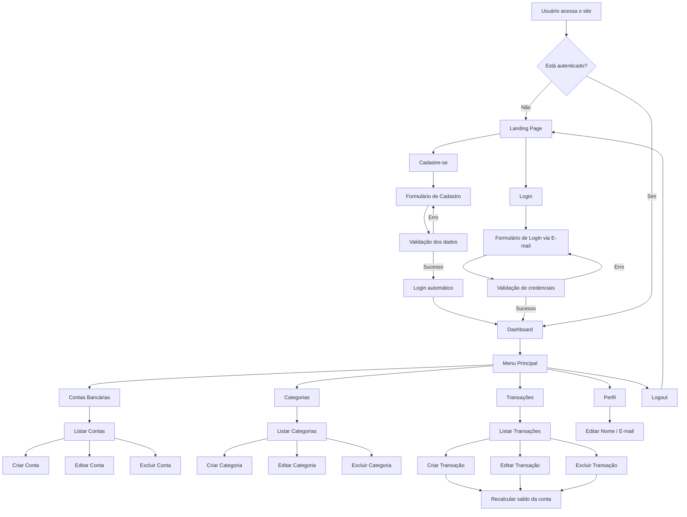
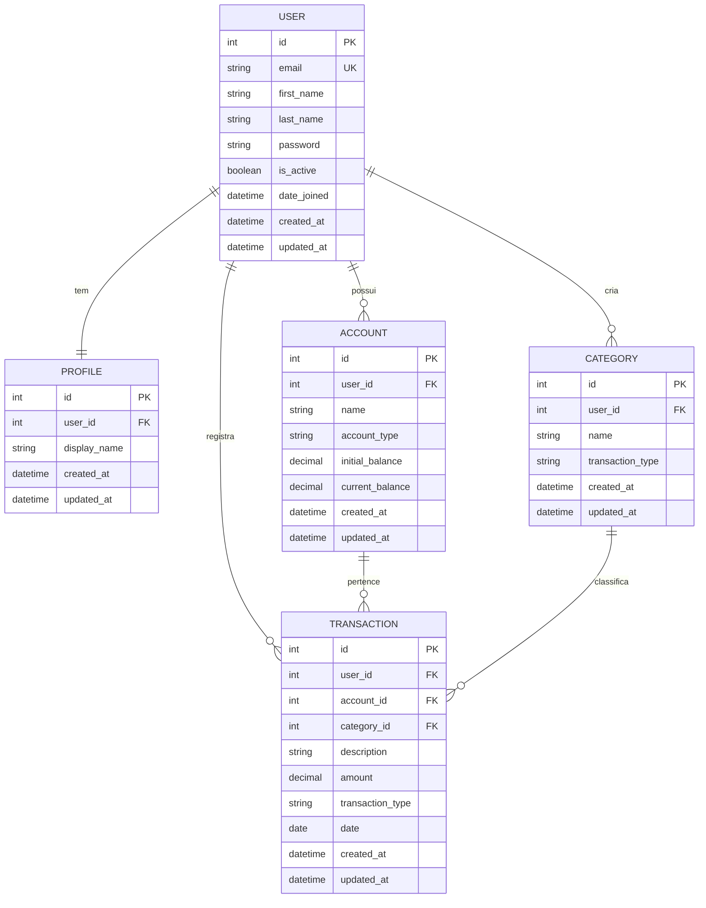

# PRD — Finanpy: Sistema de Gestão de Finanças Pessoais

> **Versão:** 1.0  
> **Data:** 05/04/2026  
> **Autor:** Igor  
> **Status:** Draft

---

## Sumário

1. [Visão Geral](#1-visão-geral)
2. [Sobre o Produto](#2-sobre-o-produto)
3. [Propósito](#3-propósito)
4. [Público-Alvo](#4-público-alvo)
5. [Objetivos](#5-objetivos)
6. [Requisitos Funcionais](#6-requisitos-funcionais)
7. [Requisitos Não-Funcionais](#7-requisitos-não-funcionais)
8. [Arquitetura Técnica](#8-arquitetura-técnica)
9. [Design System](#9-design-system)
10. [User Stories](#10-user-stories)
11. [Métricas de Sucesso](#11-métricas-de-sucesso)
12. [Riscos e Mitigações](#12-riscos-e-mitigações)
13. [Lista de Tarefas (Sprints)](#13-lista-de-tarefas-sprints)

---

## 1. Visão Geral

O **Finanpy** é um sistema web de gestão de finanças pessoais desenvolvido com Django full-stack. Permite que usuários registrem contas bancárias, categorizem transações (entradas e saídas) e acompanhem sua saúde financeira por meio de um dashboard centralizado. O projeto prioriza simplicidade, sem over-engineering, utilizando os recursos nativos do Django sempre que possível.

---

## 2. Sobre o Produto

| Atributo | Descrição |
|---|---|
| **Nome** | Finanpy |
| **Tipo** | Aplicação web full-stack |
| **Framework** | Django (Python) |
| **Frontend** | Django Template Language + TailwindCSS |
| **Banco de dados** | SQLite (padrão Django) |
| **Autenticação** | Sistema nativo do Django (login via e-mail) |
| **Idioma da interface** | Português brasileiro |
| **Idioma do código** | Inglês |

---

## 3. Propósito

Oferecer uma ferramenta simples, funcional e visualmente agradável para que pessoas possam organizar suas finanças pessoais — registrando contas, categorias e transações — sem a complexidade de ferramentas corporativas. O Finanpy visa ser o ponto de partida para o controle financeiro de quem nunca usou ou abandonou planilhas.

---

## 4. Público-Alvo

- **Jovens adultos (18-35 anos)** que estão começando a organizar suas finanças.
- **Estudantes e profissionais** que desejam controle básico de entradas e saídas.
- **Usuários não-técnicos** que precisam de uma interface intuitiva, sem jargão financeiro excessivo.
- **Pessoas que abandonaram planilhas** por achar complexo ou pouco visual.

---

## 5. Objetivos

| # | Objetivo | Métrica de validação |
|---|---|---|
| O1 | Permitir cadastro e login de usuários via e-mail | Fluxo completo funcional |
| O2 | Gerenciar contas bancárias (CRUD) | Usuário consegue criar, editar, listar e excluir contas |
| O3 | Gerenciar categorias de transações (CRUD) | Categorias criadas e atribuídas a transações |
| O4 | Registrar transações de entrada e saída (CRUD) | Transações vinculadas a conta + categoria |
| O5 | Exibir dashboard com resumo financeiro | Dashboard com saldo, totais de entrada/saída |
| O6 | Oferecer landing page pública | Página de apresentação com acesso a cadastro/login |

---

## 6. Requisitos Funcionais

### RF01 — Landing Page (pública)
- Página de apresentação do sistema.
- Botões de "Cadastre-se" e "Entrar".
- Sem acesso a funcionalidades internas.

### RF02 — Cadastro de Usuário
- Formulário com: nome, e-mail, senha, confirmação de senha.
- Validação de e-mail único.
- Login automático após cadastro (redireciona ao dashboard).

### RF03 — Login / Logout
- Login via **e-mail + senha** (não username).
- Redirecionamento ao dashboard após login.
- Logout com redirecionamento à landing page.

### RF04 — Perfil do Usuário
- Edição de nome e e-mail.
- Dados exibidos no menu do sistema (nome do usuário).

### RF05 — Gerenciamento de Contas Bancárias
- CRUD completo (criar, listar, editar, excluir).
- Campos: nome da conta, tipo (corrente, poupança, carteira, investimento), saldo inicial.
- Saldo atualizado automaticamente conforme transações.
- Cada conta pertence exclusivamente ao usuário logado.

### RF06 — Gerenciamento de Categorias
- CRUD completo.
- Campos: nome, tipo (entrada ou saída), ícone/cor (opcional).
- Categorias vinculadas ao usuário.
- Categorias padrão criadas automaticamente no cadastro (ex: Salário, Alimentação, Transporte).

### RF07 — Gerenciamento de Transações
- CRUD completo.
- Campos: descrição, valor, data, tipo (entrada/saída), conta, categoria.
- Listagem com filtros por período, tipo, conta e categoria.
- Ao criar/editar/excluir transação, o saldo da conta é recalculado.

### RF08 — Dashboard
- Saldo total (soma dos saldos de todas as contas).
- Total de entradas e saídas do mês corrente.
- Lista das últimas transações.
- Resumo por categoria (quanto foi gasto/recebido por categoria no mês).

### Flowchart — Fluxos de UX



---

## 7. Requisitos Não-Funcionais

| # | Requisito | Detalhe |
|---|---|---|
| RNF01 | **Responsividade** | Interface funcional em desktop, tablet e mobile |
| RNF02 | **Performance** | Páginas carregam em < 2s com SQLite local |
| RNF03 | **Segurança** | CSRF protection (nativo Django), senhas com hash, acesso restrito por login |
| RNF04 | **Padrão de código** | PEP08, aspas simples, código em inglês |
| RNF05 | **Isolamento de domínios** | Cada entidade em sua própria Django app |
| RNF06 | **Auditoria básica** | Campos `created_at` e `updated_at` em todos os models |
| RNF07 | **Simplicidade** | Sem over-engineering; usar recursos nativos do Django |
| RNF08 | **Banco de dados** | SQLite padrão do Django |
| RNF09 | **Interface em PT-BR** | Toda informação ao usuário em português brasileiro |
| RNF10 | **Class Based Views** | Usar CBVs sempre que possível |

---

## 8. Arquitetura Técnica

### 8.1 Stack

| Camada | Tecnologia |
|---|---|
| Linguagem | Python 3.13+ |
| Framework backend | Django 5+ |
| Frontend | Django Template Language |
| Estilização | TailwindCSS (via CDN ou standalone CLI) |
| Banco de dados | SQLite3 |
| Servidor de dev | `manage.py runserver` |
| Autenticação | `django.contrib.auth` (customizado para login via e-mail) |
| Gerenciamento de pacotes | pip + requirements.txt |

### 8.2 Estrutura de Diretórios

```
finanpy/
├── accounts/          # Contas bancárias do usuário
├── categories/        # Categorias de transações
├── core/              # Configurações globais (settings, urls, wsgi, asgi)
├── profiles/          # Perfil do usuário
├── transactions/      # Transações financeiras
├── users/             # Model de usuário customizado + autenticação
├── templates/         # Templates globais (base, landing, components)
│   ├── base.html
│   ├── components/
│   │   ├── navbar.html
│   │   ├── sidebar.html
│   │   ├── card.html
│   │   ├── modal_confirm.html
│   │   └── messages.html
│   ├── landing.html
│   └── dashboard.html
├── static/            # Arquivos estáticos globais
│   ├── css/
│   └── js/
├── db.sqlite3
├── manage.py
└── requirements.txt
```

### 8.3 Estrutura de Dados (ER Diagram)



### 8.4 Detalhamento dos Models

**User** (herda de `AbstractUser`)
- `email`: EmailField, unique, usado como USERNAME_FIELD
- `username`: removido ou ignorado no fluxo
- `created_at`: DateTimeField, auto_now_add
- `updated_at`: DateTimeField, auto_now

**Profile** (OneToOne com User)
- `user`: OneToOneField → User
- `display_name`: CharField, max 100
- `created_at` / `updated_at`

**Account**
- `user`: ForeignKey → User
- `name`: CharField, max 100
- `account_type`: CharField, choices (checking, savings, wallet, investment)
- `initial_balance`: DecimalField(10, 2), default 0
- `current_balance`: DecimalField(10, 2), default 0
- `created_at` / `updated_at`

**Category**
- `user`: ForeignKey → User
- `name`: CharField, max 50
- `transaction_type`: CharField, choices (income, expense)
- `created_at` / `updated_at`

**Transaction**
- `user`: ForeignKey → User
- `account`: ForeignKey → Account
- `category`: ForeignKey → Category
- `description`: CharField, max 200
- `amount`: DecimalField(10, 2)
- `transaction_type`: CharField, choices (income, expense)
- `date`: DateField
- `created_at` / `updated_at`

---

## 9. Design System

### 9.1 Paleta de Cores (TailwindCSS classes)

| Papel | Classe TailwindCSS | Hex aproximado | Uso |
|---|---|---|---|
| **Background principal** | `bg-gray-950` | #0B0F19 | Fundo do body |
| **Background cards** | `bg-gray-900` | #111827 | Cards, sidebar, modals |
| **Background inputs** | `bg-gray-800` | #1F2937 | Campos de formulário |
| **Border padrão** | `border-gray-700` | #374151 | Bordas de cards, inputs, dividers |
| **Texto primário** | `text-gray-100` | #F3F4F6 | Títulos, texto principal |
| **Texto secundário** | `text-gray-400` | #9CA3AF | Labels, descrições, placeholders |
| **Accent primário** | `bg-emerald-500` | #10B981 | Botões primários, entradas |
| **Accent hover** | `hover:bg-emerald-600` | #059669 | Hover de botões primários |
| **Accent secundário** | `bg-violet-500` | #8B5CF6 | Destaques, badges, links ativos |
| **Perigo / Saída** | `bg-rose-500` | #F43F5E | Botão excluir, valores de saída |
| **Sucesso** | `text-emerald-400` | #34D399 | Valores de entrada, saldo positivo |
| **Alerta** | `text-amber-400` | #FBBF24 | Avisos, saldo baixo |
| **Gradient header** | `bg-gradient-to-r from-emerald-500 to-violet-500` | — | Barra superior, títulos especiais |

### 9.2 Tipografia

| Elemento | Classes TailwindCSS |
|---|---|
| **Font família** | `font-sans` (Inter via Google Fonts como fallback do sistema) |
| **Título da página (h1)** | `text-2xl font-bold text-gray-100` |
| **Subtítulo (h2)** | `text-xl font-semibold text-gray-100` |
| **Título de card (h3)** | `text-lg font-semibold text-gray-100` |
| **Corpo de texto** | `text-sm text-gray-300` |
| **Label** | `text-sm font-medium text-gray-400` |
| **Texto auxiliar** | `text-xs text-gray-500` |

### 9.3 Botões

```html
<!-- Primário -->
<button class="bg-emerald-500 hover:bg-emerald-600 text-white font-medium
    py-2 px-4 rounded-lg transition-colors duration-200">
    Salvar
</button>

<!-- Secundário -->
<button class="bg-gray-700 hover:bg-gray-600 text-gray-200 font-medium
    py-2 px-4 rounded-lg transition-colors duration-200">
    Cancelar
</button>

<!-- Perigo -->
<button class="bg-rose-500 hover:bg-rose-600 text-white font-medium
    py-2 px-4 rounded-lg transition-colors duration-200">
    Excluir
</button>

<!-- Outline -->
<button class="border border-gray-600 hover:border-emerald-500
    text-gray-300 hover:text-emerald-400 font-medium
    py-2 px-4 rounded-lg transition-colors duration-200">
    Ver detalhes
</button>
```

### 9.4 Inputs e Formulários

```html
<!-- Campo de texto -->
<div class="mb-4">
    <label class="block text-sm font-medium text-gray-400 mb-1">E-mail</label>
    <input type="email"
        class="w-full bg-gray-800 border border-gray-700 rounded-lg
        py-2 px-3 text-gray-100 placeholder-gray-500
        focus:outline-none focus:ring-2 focus:ring-emerald-500
        focus:border-emerald-500 transition-colors duration-200"
        placeholder="seu@email.com">
</div>

<!-- Select -->
<select class="w-full bg-gray-800 border border-gray-700 rounded-lg
    py-2 px-3 text-gray-100 focus:outline-none focus:ring-2
    focus:ring-emerald-500 focus:border-emerald-500
    transition-colors duration-200">
    <option value="">Selecione...</option>
</select>

<!-- Form container -->
<form class="bg-gray-900 border border-gray-700 rounded-xl p-6 space-y-4">
    <!-- campos aqui -->
</form>
```

### 9.5 Cards

```html
<!-- Card padrão -->
<div class="bg-gray-900 border border-gray-700 rounded-xl p-6">
    <h3 class="text-lg font-semibold text-gray-100 mb-2">Título</h3>
    <p class="text-sm text-gray-400">Conteúdo do card</p>
</div>

<!-- Card com destaque (gradient top border) -->
<div class="bg-gray-900 border border-gray-700 rounded-xl p-6
    border-t-2 border-t-emerald-500">
    <h3 class="text-lg font-semibold text-gray-100 mb-2">Saldo Total</h3>
    <p class="text-3xl font-bold text-emerald-400">R$ 5.230,00</p>
</div>
```

### 9.6 Layout e Grid

```html
<!-- Container principal (logado) -->
<div class="min-h-screen bg-gray-950 text-gray-100">
    <!-- Navbar fixa no topo -->
    <nav class="bg-gray-900 border-b border-gray-700 px-6 py-3">
        <!-- logo, menu, user info -->
    </nav>

    <div class="flex">
        <!-- Sidebar (desktop) -->
        <aside class="hidden md:block w-64 bg-gray-900 border-r
            border-gray-700 min-h-screen p-4">
            <!-- links de navegação -->
        </aside>

        <!-- Conteúdo principal -->
        <main class="flex-1 p-6">
            <!-- conteúdo da página -->
        </main>
    </div>
</div>

<!-- Grid responsivo para cards do dashboard -->
<div class="grid grid-cols-1 md:grid-cols-2 lg:grid-cols-3 gap-6">
    <!-- cards -->
</div>

<!-- Grid de tabela responsiva -->
<div class="overflow-x-auto">
    <table class="w-full text-sm text-left">
        <thead class="text-xs text-gray-400 uppercase bg-gray-800">
            <tr>
                <th class="px-4 py-3">Coluna</th>
            </tr>
        </thead>
        <tbody class="divide-y divide-gray-700">
            <tr class="bg-gray-900 hover:bg-gray-800 transition-colors">
                <td class="px-4 py-3 text-gray-300">Valor</td>
            </tr>
        </tbody>
    </table>
</div>
```

### 9.7 Navbar e Sidebar

```html
<!-- Navbar -->
<nav class="bg-gray-900/80 backdrop-blur-sm border-b border-gray-700
    px-6 py-3 flex items-center justify-between sticky top-0 z-50">
    <!-- Logo com gradient -->
    <a href="/" class="text-xl font-bold bg-gradient-to-r
        from-emerald-400 to-violet-400 bg-clip-text text-transparent">
        Finanpy
    </a>
    <!-- User menu -->
    <div class="flex items-center gap-4">
        <span class="text-sm text-gray-400">Olá, {{ user.first_name }}</span>
        <a href="" class="text-sm text-gray-400 hover:text-rose-400
            transition-colors">Sair</a>
    </div>
</nav>

<!-- Sidebar item -->
<a href="#" class="flex items-center gap-3 px-3 py-2 rounded-lg
    text-gray-400 hover:text-gray-100 hover:bg-gray-800
    transition-colors duration-200">
    <!-- ícone SVG -->
    <span class="text-sm font-medium">Dashboard</span>
</a>

<!-- Sidebar item ativo -->
<a href="#" class="flex items-center gap-3 px-3 py-2 rounded-lg
    text-emerald-400 bg-emerald-500/10">
    <!-- ícone SVG -->
    <span class="text-sm font-medium">Dashboard</span>
</a>
```

### 9.8 Mensagens de Feedback (Django Messages)

```html
<!-- Sucesso -->
<div class="bg-emerald-500/10 border border-emerald-500/30 text-emerald-400
    rounded-lg px-4 py-3 text-sm">
    Operação realizada com sucesso!
</div>

<!-- Erro -->
<div class="bg-rose-500/10 border border-rose-500/30 text-rose-400
    rounded-lg px-4 py-3 text-sm">
    Erro ao processar sua solicitação.
</div>

<!-- Alerta -->
<div class="bg-amber-500/10 border border-amber-500/30 text-amber-400
    rounded-lg px-4 py-3 text-sm">
    Atenção: verifique os campos destacados.
</div>
```

### 9.9 Modal de Confirmação

```html
<!-- Overlay + Modal -->
<div class="fixed inset-0 bg-black/60 backdrop-blur-sm flex items-center
    justify-center z-50">
    <div class="bg-gray-900 border border-gray-700 rounded-xl p-6
        w-full max-w-md mx-4">
        <h3 class="text-lg font-semibold text-gray-100 mb-2">
            Confirmar exclusão
        </h3>
        <p class="text-sm text-gray-400 mb-6">
            Tem certeza que deseja excluir este item? Esta ação não pode ser desfeita.
        </p>
        <div class="flex justify-end gap-3">
            <button class="bg-gray-700 hover:bg-gray-600 text-gray-200
                font-medium py-2 px-4 rounded-lg">Cancelar</button>
            <button class="bg-rose-500 hover:bg-rose-600 text-white
                font-medium py-2 px-4 rounded-lg">Excluir</button>
        </div>
    </div>
</div>
```

---

## 10. User Stories

### Épico 1 — Autenticação e Perfil

**US01 — Cadastro de usuário**
> Como visitante, quero me cadastrar com nome, e-mail e senha para ter acesso ao sistema.

Critérios de aceite:
- Formulário exige nome, e-mail, senha e confirmação de senha.
- E-mail deve ser único; exibir erro se já cadastrado.
- Senha com mínimo de 8 caracteres (validação nativa Django).
- Após cadastro, o usuário é logado automaticamente e redirecionado ao dashboard.

**US02 — Login via e-mail**
> Como usuário cadastrado, quero fazer login com meu e-mail e senha para acessar o sistema.

Critérios de aceite:
- Campo de login é **e-mail** (não username).
- Mensagem de erro genérica em caso de credenciais inválidas.
- Após login, redireciona ao dashboard.

**US03 — Logout**
> Como usuário logado, quero fazer logout para encerrar minha sessão.

Critérios de aceite:
- Botão de logout visível no menu/navbar.
- Após logout, redireciona à landing page.

**US04 — Edição de perfil**
> Como usuário logado, quero editar meu nome e e-mail.

Critérios de aceite:
- Formulário pré-preenchido com dados atuais.
- Validação de e-mail único ao alterar.
- Mensagem de sucesso após salvar.

### Épico 2 — Contas Bancárias

**US05 — Criar conta bancária**
> Como usuário logado, quero criar uma conta bancária para registrar meu saldo.

Critérios de aceite:
- Campos: nome, tipo (Corrente, Poupança, Carteira, Investimento), saldo inicial.
- Saldo atual é definido como saldo inicial na criação.
- Conta vinculada ao usuário logado.

**US06 — Listar contas bancárias**
> Como usuário logado, quero ver todas as minhas contas bancárias e seus saldos.

Critérios de aceite:
- Lista apenas contas do usuário logado.
- Exibe nome, tipo e saldo atual de cada conta.
- Botões de editar e excluir por conta.

**US07 — Editar conta bancária**
> Como usuário logado, quero editar nome e tipo da minha conta.

Critérios de aceite:
- Formulário pré-preenchido.
- Não permite editar saldo inicial (é histórico).
- Mensagem de sucesso.

**US08 — Excluir conta bancária**
> Como usuário logado, quero excluir uma conta que não uso mais.

Critérios de aceite:
- Modal de confirmação antes de excluir.
- Exclui todas as transações vinculadas (CASCADE) ou impede exclusão se houver transações (definir na sprint).
- Mensagem de sucesso.

### Épico 3 — Categorias

**US09 — Criar categoria**
> Como usuário logado, quero criar categorias para organizar minhas transações.

Critérios de aceite:
- Campos: nome e tipo (Entrada ou Saída).
- Categoria vinculada ao usuário logado.

**US10 — Listar categorias**
> Como usuário logado, quero ver todas as minhas categorias.

Critérios de aceite:
- Lista separada ou filtrada por tipo (entrada/saída).
- Botões de editar e excluir.

**US11 — Editar categoria**
> Como usuário logado, quero editar o nome e tipo de uma categoria.

Critérios de aceite:
- Formulário pré-preenchido.
- Mensagem de sucesso.

**US12 — Excluir categoria**
> Como usuário logado, quero excluir uma categoria que não uso mais.

Critérios de aceite:
- Modal de confirmação.
- Impede exclusão se houver transações vinculadas (exibe mensagem).

**US13 — Categorias padrão no cadastro**
> Como novo usuário, quero ter categorias pré-cadastradas para começar a usar rápido.

Critérios de aceite:
- Ao criar conta, gerar automaticamente: Salário, Freelance (entrada); Alimentação, Transporte, Moradia, Lazer, Saúde, Educação (saída).
- Implementado via signal `post_save` no model User.

### Épico 4 — Transações

**US14 — Criar transação**
> Como usuário logado, quero registrar uma transação de entrada ou saída.

Critérios de aceite:
- Campos: descrição, valor, data, tipo (entrada/saída), conta, categoria.
- Categorias filtradas pelo tipo selecionado.
- Ao salvar, o saldo da conta é atualizado (+ para entrada, - para saída).

**US15 — Listar transações**
> Como usuário logado, quero ver todas as minhas transações.

Critérios de aceite:
- Listagem paginada (20 por página).
- Filtros: período (data inicial/final), tipo, conta, categoria.
- Exibe: data, descrição, categoria, conta, valor (verde entrada, vermelho saída).

**US16 — Editar transação**
> Como usuário logado, quero editar uma transação existente.

Critérios de aceite:
- Formulário pré-preenchido.
- Ao salvar, recalcular saldo da conta (reverter valor antigo, aplicar novo).

**US17 — Excluir transação**
> Como usuário logado, quero excluir uma transação errada.

Critérios de aceite:
- Modal de confirmação.
- Ao excluir, reverter o efeito no saldo da conta.

### Épico 5 — Dashboard

**US18 — Visualizar dashboard**
> Como usuário logado, quero ver um resumo da minha situação financeira ao entrar no sistema.

Critérios de aceite:
- Card com saldo total (soma de todas as contas).
- Card com total de entradas do mês corrente.
- Card com total de saídas do mês corrente.
- Card com balanço do mês (entradas - saídas).
- Lista das 5 últimas transações.
- Resumo de gastos por categoria (mês corrente).

### Épico 6 — Landing Page

**US19 — Página de apresentação**
> Como visitante, quero ver uma página bonita que explique o sistema e me permita cadastrar ou entrar.

Critérios de aceite:
- Hero section com título, descrição e CTA para cadastro.
- Seção de funcionalidades.
- Botões "Cadastre-se" e "Entrar" visíveis.
- Se já logado, redireciona ao dashboard.

---

## 11. Métricas de Sucesso

### KPIs de Produto

| Métrica | Descrição | Meta |
|---|---|---|
| Funcionalidades entregues | CRUDs + dashboard completos e funcionais | 100% dos RF |
| Bugs críticos | Bugs que impedem uso em produção | 0 |
| Consistência visual | Todas as telas seguem o Design System | 100% |

### KPIs de Usuário

| Métrica | Descrição | Meta |
|---|---|---|
| Cadastro → Dashboard | Usuário consegue cadastrar e chegar ao dashboard | < 60s |
| Tempo para criar transação | Do clique em "Nova transação" ao salvamento | < 30s |
| Compreensão da interface | Usuário realiza tarefas sem instrução | > 90% das tarefas |

### KPIs Técnicos

| Métrica | Descrição | Meta |
|---|---|---|
| Tempo de carregamento | Páginas autenticadas | < 2s |
| Cobertura de código | (para sprints finais) | > 80% |
| Conformidade PEP08 | Código passa em linters | 100% |

---

## 12. Riscos e Mitigações

| # | Risco | Impacto | Probabilidade | Mitigação |
|---|---|---|---|---|
| R1 | TailwindCSS via CDN causa lentidão | Médio | Baixa | Migrar para TailwindCSS standalone CLI se necessário |
| R2 | SQLite não suporta concorrência | Baixo | Baixa | Sistema é mono-usuário local; migrar para PostgreSQL se escalar |
| R3 | Perda de dados sem backup | Alto | Média | Documentar rotina de backup do db.sqlite3 |
| R4 | Complexidade crescente sem testes | Alto | Alta | Sprints finais dedicados a testes automatizados |
| R5 | Login por e-mail conflita com libs de terceiros | Médio | Baixa | Usar `AbstractUser` com `USERNAME_FIELD = 'email'` desde o início |
| R6 | Inconsistência de saldos | Alto | Média | Centralizar lógica de atualização de saldo em método do model ou signal |
| R7 | Scope creep (adição de features fora do escopo) | Médio | Alta | Seguir estritamente o PRD; não implementar o que não for solicitado |


> **Nota final:** Este PRD é um documento vivo. Deve ser atualizado conforme decisões evoluam durante as sprints. Priorizar entregas incrementais e evitar adicionar funcionalidades fora do escopo definido.